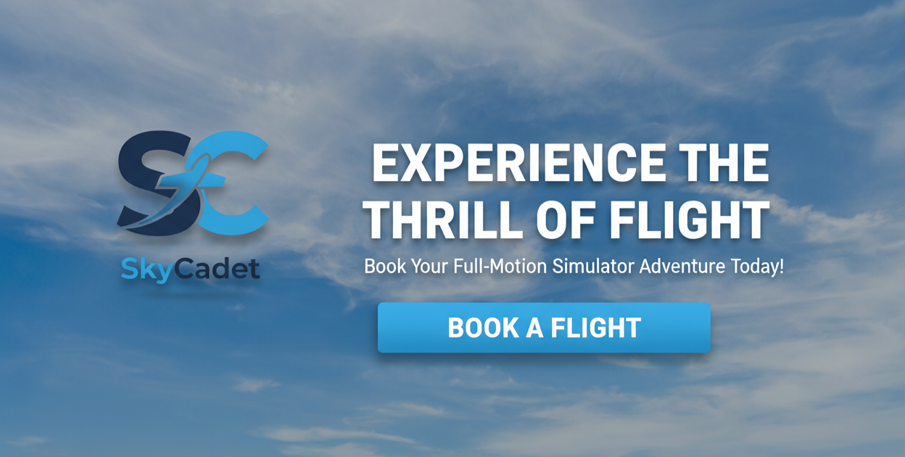
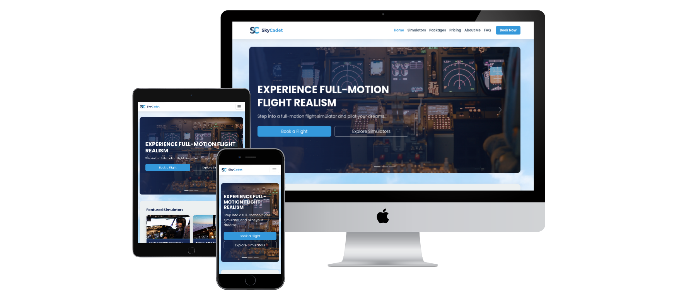
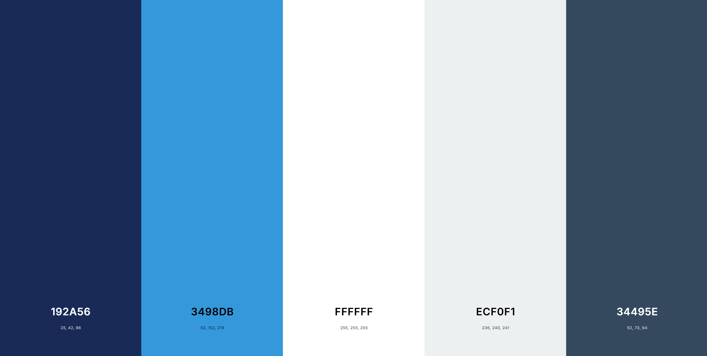
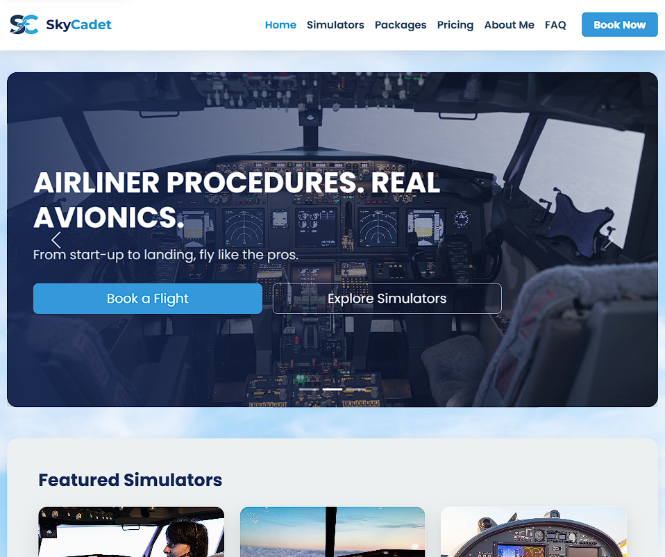
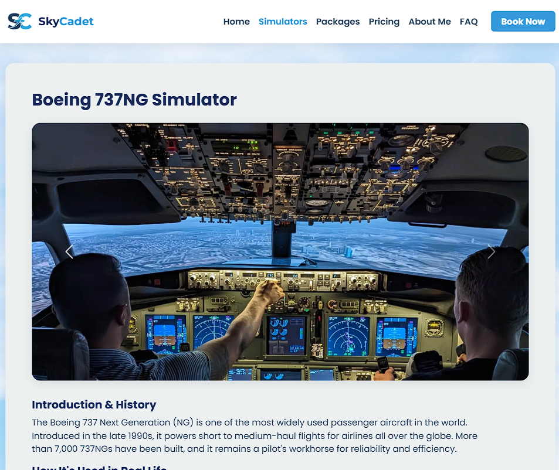
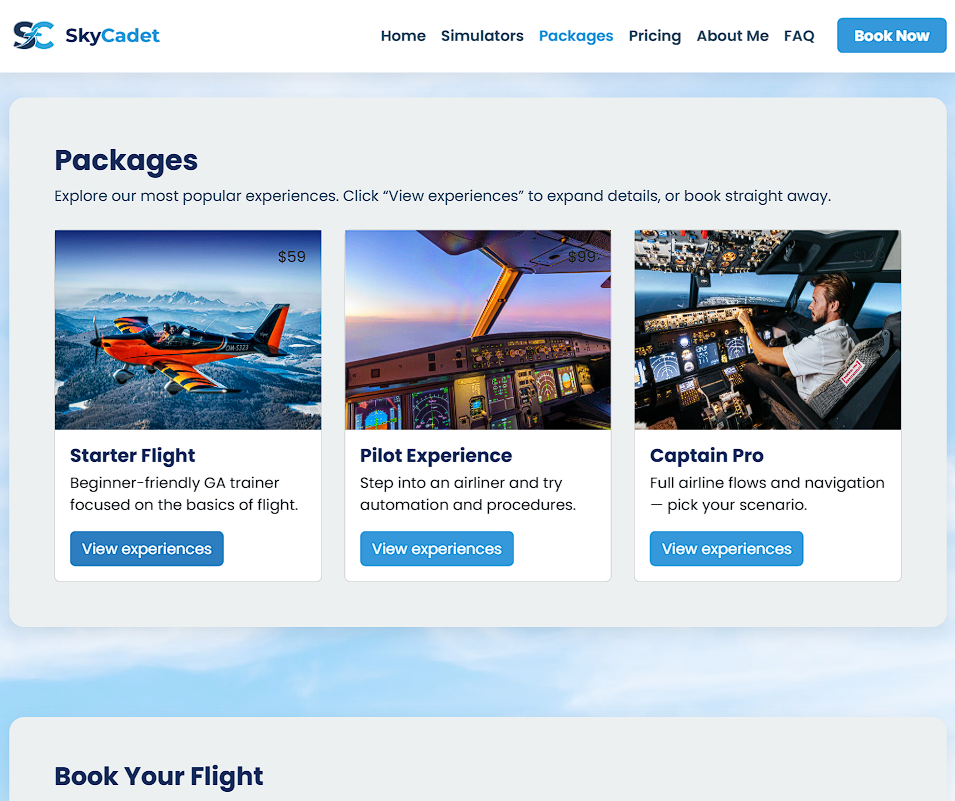
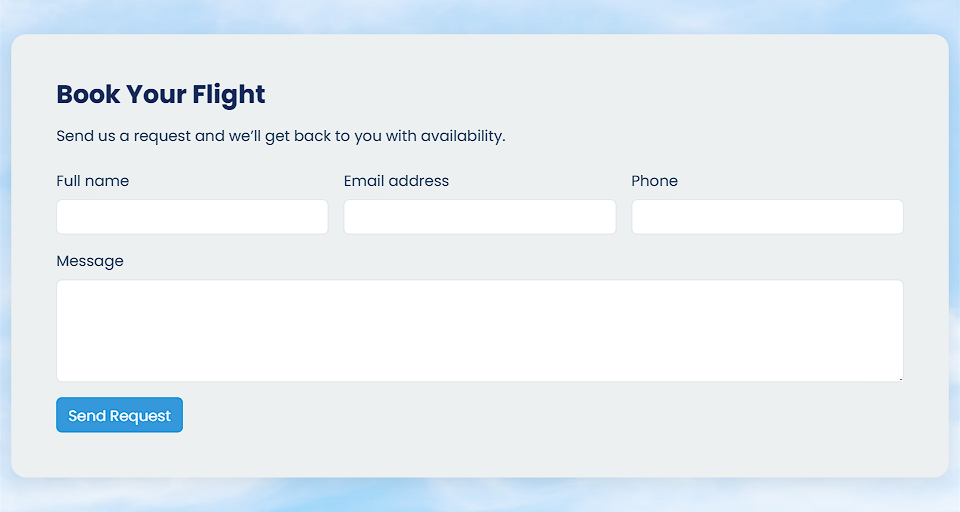
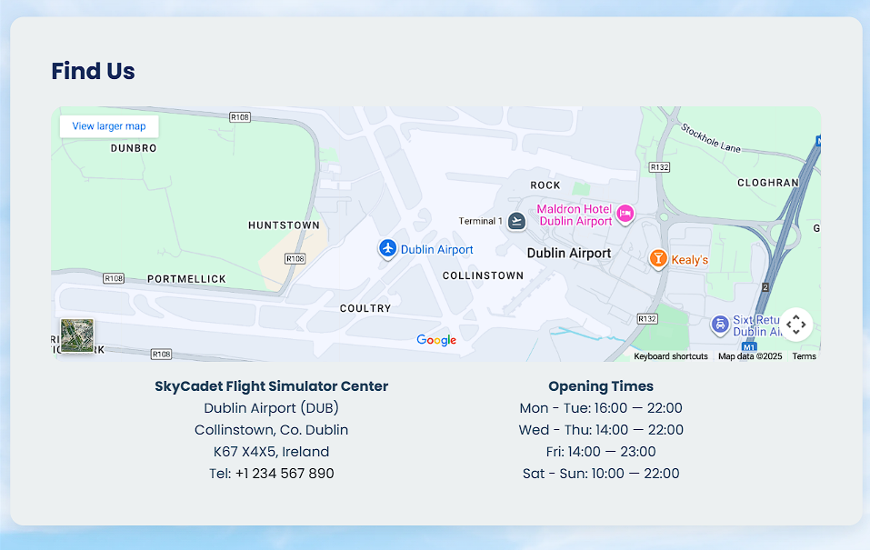

# SkyCadet Flight Simulator Center ✈️

**SkyCadet** is a multi-page, responsive website for a fictional full-motion flight simulator center. Designed for aviation enthusiasts, aspiring pilots, and families, the site showcases various flight experiences, provides clear pricing, and allows users to make booking inquiries. This project was built using **HTML, CSS, and Bootstrap 5**, emphasizing best practices in front-end development, user experience, and accessibility. 🌐💻

---

## Table of Contents

1. [Project Overview](#project-overview)
2. [User Experience (UX)](#user-experience-ux)
   - [Target Audience](#target-audience)
   - [User Stories](#user-stories)
   - [Site Owner Goals](#site-owner-goals)
3. [Design & Theme](#design--theme)
   - [Color Palette](#color-palette)
   - [Typography](#typography)
   - [Imagery](#imagery)
4. [Features](#features)
   - [Existing Features (MVP)](#existing-features-mvp)
5. [Technologies Used](#technologies-used)
6. [Testing](#testing)
7. [Deployment](#deployment)
8. [AI-Assisted Development](#ai-assisted-development)
9. [Credits](#credits)
   - [Content](#content)
   - [Media & Images](#media-and-images)
10. [Acknowledgements](#acknowledgements)

---

## Project Overview

This project serves as a **portfolio piece** demonstrating proficiency in front-end web development technologies. The goal was to create a professional, engaging, and fully responsive website for a fictional flight simulator center. 🛫  

The website is multi-page, providing a clear and organized user journey from initial interest to booking inquiry.

---

## User Experience (UX)

### Target Audience

* **Aviation Enthusiasts & Beginners:** Individuals curious about flying who want to experience a realistic flight simulator for fun or preliminary training. 
* **Parents & Families:** People looking for unique, safe, and exciting activities suitable for a wide range of ages. 

### User Stories

The project was guided by user-centric goals, prioritized using the MoSCoW method. Key "Must-Have" stories include:

* As a visitor, I want to see a captivating **homepage** so I can immediately understand what the service.  
* As a user, I need a clear and consistent **navigation bar** to easily browse the sections. 
* As a potential customer, I want to view the available **simulator experiences** with details and images to help me choose.   
* As a budget-conscious user, I want to see a transparent **pricing page** with different packages.  
* As an interested customer, I need a **booking/contact form** to make an inquiry.  
* As a visitor, I want to find the business **location** easily via an embedded map and address. 

### Site Owner Goals

* Present the flight simulator center as a professional, safe, and thrilling destination.  
* Ensure clear, intuitive navigation across all pages.  
* Showcase simulator experiences and pricing transparently to build trust.  
* Generate leads via a contact/booking form.  
* Establish credibility and excitement through high-quality photos, about me section, FAQ, and well-structured content. 

---

## Design & Theme

The design is professional, modern, and immersive, evoking the feeling of a sleek aircraft cockpit and the open sky. 

### Color Palette

| Color                  | Hex       | Usage & Rationale |
| ---------------------- | :------: | ---------------- |
| **Primary Navy**        | `#192A56` | Headings, important text, footers/headers, CTA backgrounds. |
| **Secondary Sky Blue**  | `#3498DB` | Main CTA buttons, hover states, accent features, highlights. |
| **Neutral White**       | `#FFFFFF` | Main background, text on dark backgrounds. |
| **Neutral Light Gray**  | `#ECF0F1` | Section dividers, subtle backgrounds, borders. |
| **Accent Dark Gray**    | `#34495E` | Body text, secondary headings. |

### Typography

* [**Poppins**](https://fonts.google.com/specimen/Poppins) font is used for a clean, modern, and readable aesthetic. 

### Imagery

* High-quality images of cockpits, aerial landscapes, and simulators to create an immersive experience. 

---

## Features

### Existing Features (MVP)

* **Navigation Bar:** Responsive navbar with links to all main sections, collapses to hamburger menu on mobile.   

* **Homepage:** Hero banner, intro section, simulator highlights.   

* **Simulators Page:** Bootstrap cards for Boeing 737, Airbus A320, and Viper SD-4.   

* **Packages Page:** Clear, card-based pricing and feature details.   

* **Booking Form:** Contact form (static) with validation. 

* **Location:** Embedded Google Map with address.  

* **Footer:** Social media links and copyright info.

---

## Technologies Used

* **HTML5, CSS3, Bootstrap 5**   
* **Git & GitHub**   
* **Visual Studio Code**   
* **Google Fonts**  
* **Font Awesome**   
* **W3C & Jigsaw Validators** 

---

## Testing

* Responsiveness across devices  
* Browser compatibility (Chrome, Firefox, Edge)   
* HTML & CSS validation  
* Accessibility checks 

---

## Deployment

The website is live at: [SkyCadet Flight Simulator](https://tigerpadla.github.io/skycadet-flight-sim/)

---

## AI-Assisted Development

* Debugging, content optimization, logo & design assistance, documentation.

---

## Credits

### Content
* All text content was written specifically for this project. ✍️

### Media and Images
* **Freepik:** [Boeing 737 Cockpit](https://www.freepik.com/) images. 
* **Pixabay:** [Airbus A320 Cockpit](https://pixabay.com/) images. 
* **JetPhotos:** [VIPER SD4 Cockpit](https://www.jetphotos.com/photo/10194298) image by Jakub Fedorowicz. 
* **TomarkAero:** [Viper SD4 Aircraft](https://www.tomarkaero.com/) images used for exterior and cockpit shots. 
* **Facebook:** Additional [Viper SD4 Cockpit](https://www.facebook.com/photo/?fbid=805851100331826&set=pcb.805854170331519) image.
* **Vliegles.nl:** [Airbus A320 Simulator](https://www.vliegles.nl/images/thumbnails/product_image-4835-1875x1055.jpeg) photo. 
* **Reuters:** [Boeing 737 Takeoff](https://www.reuters.com/resizer/v2/https%3A%2F%2Fcloudfront-us-east-2.images.arcpublishing.com%2Freuters%2FOBDQOVK36FPWVKE6LOB2PMG6HY.jpg?auth=ecd43f29b592fa72c5ad8caf5b5b7fcfe231c47edb8669fed873997bb86256d0&width=4226&quality=80) image. 
* **Wikimedia Commons:** [Aer Lingus A320](https://upload.wikimedia.org/wikipedia/commons/thumb/8/8c/Aer_Lingus_Airbus_A320_Lofting-1.jpg/1024px-Aer_Lingus_Airbus_A320_Lofting-1.jpg) and [Aerial Dublin](https://upload.wikimedia.org/wikipedia/commons/9/92/Dublin_-_aerial_-_2025-07-07_01.jpg) photos. 
* **Squarespace CDN:** [Atlantic Sunset](https://images.squarespace-cdn.com/content/v1/5992ff526b8f5b29a7f3d45d/1580231682989-VRG6ZY3UPQ9WSVY0UTKL/20190912-_GAL9794-Edit.jpg) image. 
* **Aro.ie:** [Ross Castle](https://scdn.aro.ie/Sites/50/flightlink/uploads/images/FullLengthImages/Medium/Aerial_view__Ross_castle__Killarney_National_Park__Co_Kerry_Web_Size__2_.jpg) aerial view. 

---

## Acknowledgements

I would like to thank our **bootcamp facilitator** for their guidance and support throughout this project. I also extend my gratitude to the **Code Institute team** and the **NetApp team** for providing resources, mentorship, and inspiration. My personal background in aviation was a great source of motivation for bringing this flight simulator experience to life. ✈️
